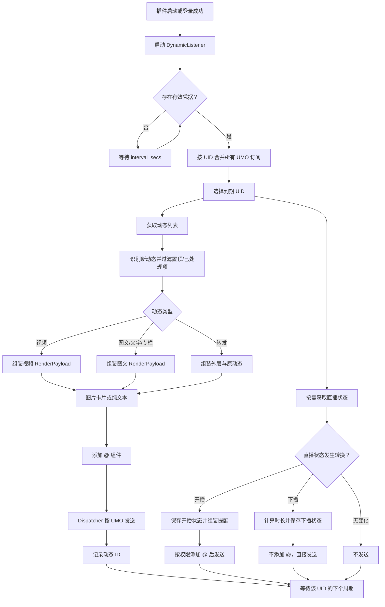

# Bilibili 订阅定时获取与提醒发送逻辑

本文档描述当前代码中的真实行为，作为后续调整视频、图文和直播提醒内容与发送方式的基线。

## 1. 功能边界

当前插件只保留 Bilibili 登录、凭据持久化、订阅管理、定时检测和订阅提醒。

用户侧看到的三类订阅内容是：

1. 视频动态。
2. 图文动态。
3. 直播状态。

代码中的分类比上述三类更细：

| 产品分类 | Bilibili 动态类型 | 当前处理方式 |
| --- | --- | --- |
| 视频 | `DYNAMIC_TYPE_AV` | 按视频动态处理 |
| 图文 | `DYNAMIC_TYPE_DRAW` | 按图文动态处理 |
| 图文 | `DYNAMIC_TYPE_WORD` | 与图文动态共用处理逻辑 |
| 图文 | `DYNAMIC_TYPE_ARTICLE` | 使用专栏处理逻辑 |
| 图文的特殊形态 | `DYNAMIC_TYPE_FORWARD` | 组装当前转发内容和原动态 |
| 直播 | 直播间 `live_status` | 不属于动态列表，使用独立直播接口检测 |

因此，视频和图文并不是三个独立的定时任务。它们来自同一次动态列表请求，然后在本地按类型分类。直播状态使用另一个接口请求。

## 2. 核心模块

| 模块 | 职责 |
| --- | --- |
| `main.py` | 插件初始化、登录、订阅命令、后台任务启动和终止 |
| `bili_client.py` | Bilibili 凭据构造、动态列表、直播状态和 UP 主资料请求 |
| `services/subscription_service.py` | 新增或更新订阅，首次订阅时初始化动态游标 |
| `services/listener.py` | UID 调度、动态分类、过滤、提醒组装、直播状态转换和发送协调 |
| `services/renderer.py` | 将动态或直播数据转换为 `RenderPayload`，并渲染 HTML 卡片 |
| `services/dispatcher.py` | 重连静默判断、UMO 消息发送和发送结果封装 |
| `core/models.py` | 订阅记录、动态解析结果及渲染数据结构 |
| `core/data_manager.py` | 凭据、订阅游标、直播状态和订阅配置持久化 |

## 3. 登录与任务启动

插件初始化时按以下优先级建立 Bilibili 客户端：

1. 优先读取插件数据文件中已持久化的完整凭据。
2. 没有持久化凭据时，使用 `_conf_schema.json` 对应配置中的 `sessdata`。
3. 两者都没有时，监听循环仍会启动，但每轮只记录缺少凭据的警告并等待。

`/bili_login` 扫码成功后会：

1. 把新凭据设置到当前 `BiliClient`。
2. 将凭据字典写入插件标准数据目录。
3. 取消旧监听任务并启动新任务。

`/bili_logout` 会：

1. 清除内存和数据文件中的扫码凭据。
2. 用配置中的 `sessdata` 重新创建 `BiliClient`。
3. 替换监听器持有的客户端并重启监听任务。

插件停用或重载时，`terminate()` 会取消并等待监听任务结束。监听循环收到 `asyncio.CancelledError` 后继续向外传播，从而正常完成清理。

## 4. 订阅数据结构

订阅数据按 UMO 隔离。顶层结构可概括为：

```json
{
  "bili_sub_list": {
    "平台:消息类型:会话ID": [
      {
        "uid": 123456,
        "last": "最近处理的动态ID",
        "is_live": false,
        "filter_types": [],
        "filter_regex": [],
        "recent_ids": [],
        "live_atall": false,
        "last_live_start_ts": 0,
        "at_all": false,
        "at_sub_users": []
      }
    ]
  }
}
```

字段语义：

| 字段 | 含义 |
| --- | --- |
| `uid` | 被订阅 UP 主的 Bilibili UID |
| `last` | 最近处理过的动态 ID |
| `recent_ids` | 最近动态 ID 缓存，用于补充去重 |
| `is_live` | 上一次检测后记录的直播状态 |
| `last_live_start_ts` | 最近一次开播时间，用于计算下播时长 |
| `filter_types` | 类型过滤项，命中的内容不提醒 |
| `filter_regex` | 正文正则过滤项，命中的内容不提醒 |
| `at_all` | 普通动态和开播提醒尝试 `@全体成员` |
| `live_atall` | 仅开播提醒尝试 `@全体成员` |
| `at_sub_users` | 提醒时需要单独 @ 的用户 ID |

所有记录通过 `StarTools.get_data_dir(plugin_name="astrbot_plugin_bilibili")` 下的 JSON 文件保存。保存操作使用 `asyncio.to_thread()`，避免同步文件写入直接阻塞事件循环。

## 5. 新增和更新订阅

### 5.1 参数解析

`/bili_sub <UID> [参数...]` 将参数分成三组：

- 类型过滤：`forward`、`lottery`、`video`、`article`、`draw`、`live`、`forward_lottery`。
- 提醒选项：`at_all`、`live_atall`、`at_sub`、`unat_sub`。
- 其余字符串：作为正文过滤正则表达式保存。

这里的过滤项表达的是“不发送”。例如 `video` 表示过滤视频，而不是只订阅视频。

### 5.2 首次订阅

首次订阅的处理顺序是：

1. 创建 `SubscriptionRecord` 并立即保存。
2. 拉取一次当前动态列表。
3. 使用与正式轮询相同的解析和过滤逻辑遍历当前动态。
4. 把得到的动态 ID 写入 `last` 和 `recent_ids`。
5. 不发送这些已有动态。

这一步的目的，是把订阅建立时已经存在的动态初始化为已处理，避免刚订阅就补发一批历史内容。

如果初始化请求失败，订阅本身仍然创建成功。下一次轮询可能将接口返回范围内的动态视为新内容。

### 5.3 更新订阅

同一 UMO 对同一 UID 再次执行订阅命令时，更新已有记录，不创建重复项。

只使用 `at_all`、`at_sub` 或 `unat_sub` 等提醒选项且未提供过滤项时，代码会继承原过滤规则。普通的重新订阅则会用本次提供的过滤规则替换原规则。

## 6. 定时调度

### 6.1 UID 级合并

每轮调度先把所有 UMO 下的订阅转换成：

```text
UID -> [(UMO, SubscriptionRecord), ...]
```

多个群或私聊订阅同一个 UID 时，动态列表和直播状态对该 UID 只请求一次，随后针对各订阅记录分别过滤和发送。

### 6.2 调度周期

关键配置：

| 配置 | 默认值 | 语义 |
| --- | ---: | --- |
| `interval_secs` | 300 | 同一个 UID 完成一次检查后，到下一次可检查的间隔 |
| `task_gap_secs` | 20 | 两个不同 UID 任务之间的最小间隔 |
| `dynamic_limit` | 5 | 单个订阅在一次检查中最多发送的动态数量 |
| `recent_dynamic_cache` | 4 | 每个订阅保存的最近动态 ID 数量 |

监听任务启动时，当前所有 UID 都立即进入到期状态。每个 UID 执行完成后，以完成时间加 `interval_secs` 计算下一次运行时间。

没有订阅时每 2 秒重新检查一次。没有凭据时等待一个完整 `interval_secs` 后重试。调度器异常会记录堆栈并在 1 秒后继续，不会终止整个监听任务。

### 6.3 单个 UID 的请求

每次 UID 任务最多执行两类请求：

1. `get_latest_dynamics(uid)`：获取视频、图文、文字、专栏和转发动态。
2. `get_live_info_by_uids([uid])`：获取直播状态。

只有当该 UID 至少有一个订阅没有配置 `live` 过滤时，才请求直播接口。动态请求失败不阻止直播请求，直播请求失败也不阻止动态处理。

## 7. 新动态识别与通用过滤

### 7.1 新动态识别

接口返回动态列表后，代码执行以下判断：

1. 跳过缺少 `modules` 的异常条目。
2. 跳过带“置顶”标记的动态。
3. 从最新向旧遍历。
4. 遇到 `last` 或 `recent_ids` 中任一已知 ID 时停止继续向旧扫描。
5. 此前收集的条目视为本轮新动态。

解析结果会反转成从旧到新的顺序发送，尽量保持发布时间顺序。

### 7.2 通用处理规则

- 支持的动态会生成 `DynamicParseResult.deliver(payload, dyn_id)`。
- 被过滤的动态生成带 `dyn_id` 的 `skip` 结果。
- 未支持的未知动态类型使用空 `dyn_id` 跳过，避免未知类型挤占正常动态缓存。
- 被过滤的已知动态仍会记录为已处理，后续不会反复检查。
- 超过 `dynamic_limit` 的动态不会发送，但仍会记录为已处理。

## 8. 视频动态逻辑

视频对应 `DYNAMIC_TYPE_AV`。

### 8.1 过滤

当订阅的 `filter_types` 包含 `video` 时，直接跳过该动态并记录动态 ID。视频动态当前不应用用户自定义正文正则过滤。

### 8.2 内容组装

从动态数据中提取：

- UP 主名称、头像和头像挂件。
- 视频标题。
- BV 号。
- 视频封面。
- 动态附言。
- 视频链接 `https://www.bilibili.com/video/<BV号>`。
- 指向视频链接的二维码。

`RenderPayload.type` 保留为 `DYNAMIC_TYPE_AV`。纯文本模式据此把动作显示为“投稿了新视频”。

## 9. 图文动态逻辑

### 9.1 图文和文字动态

`DYNAMIC_TYPE_DRAW` 和 `DYNAMIC_TYPE_WORD` 共用处理函数。

处理规则：

1. `filter_types` 包含 `draw` 时跳过。
2. `major.type` 为 `MAJOR_TYPE_BLOCKED` 时跳过充电专属内容。
3. 第一段富文本是“互动抽奖”且包含 `lottery` 过滤时跳过。
4. 摘要正文命中任一 `filter_regex` 时跳过。
5. 其余内容进入提醒组装。

组装字段包括作者信息、标题、摘要正文、最多 9 张图片、动态跳转链接和二维码。没有图片且启用图片卡片时，会使用插件 Logo 作为占位图。

### 9.2 专栏动态

`DYNAMIC_TYPE_ARTICLE` 使用独立入口：

1. `filter_types` 包含 `article` 时跳过。
2. 充电专属内容跳过。
3. 其余内容复用图文 `RenderPayload` 构造。

当前专栏分支不应用用户自定义正文正则过滤。

### 9.3 转发动态

`DYNAMIC_TYPE_FORWARD` 同时组装当前转发者内容和原动态内容。

过滤顺序：

1. 原动态是互动抽奖且配置 `forward_lottery` 时跳过。
2. 配置 `forward` 时跳过全部转发动态。
3. 当前转发正文符合开奖文案且配置 `lottery` 时跳过。
4. 当前转发正文命中 `filter_regex` 时跳过。

通过过滤后：

- 外层内容使用当前转发者、转发正文、动态链接和二维码。
- 内层 `forward` 保存原作者、标题、正文和第一张原图。
- 纯文本模式显示“转发内容”；图片模式在同一卡片内展示原动态区域。

## 10. 直播状态逻辑

直播不是按固定间隔重复提醒，而是检测状态转换。

| 上次状态 | 当前状态 | 行为 |
| --- | --- | --- |
| 未开播 | 未开播 | 不发送 |
| 未开播 | 开播 | 发送开播提醒，保存 `is_live=true` 和开播时间 |
| 开播 | 开播 | 不发送，刷新可用的开播时间 |
| 开播 | 未开播 | 发送下播提醒，保存 `is_live=false` 并清空开播时间 |

### 10.1 开播提醒

开播内容包含：

- `你订阅的UP「名称」开播了`。
- 直播间标题。
- 用户设置的直播封面。
- 直播间链接。
- 直播间二维码。

开播提醒可以触发 `at_all`、`live_atall` 或 `at_sub_users`。

### 10.2 下播提醒

下播时使用当前时间减去保存的开播时间计算直播时长，并按小时、分钟、秒格式化。缺少有效开播时间时只发送下播文案，不显示时长。

下播提醒明确不添加 `@全体成员` 或指定用户 @。

## 11. 消息组装方式

### 11.1 图片卡片模式

`rai=true` 时：

1. `Renderer` 将 `RenderPayload` 送入当前 HTML 模板。
2. 最多尝试渲染 3 次，每次失败后等待 2 秒。
3. 输出文件必须存在、大于 4096 字节且能被 Pillow 验证。
4. 图片高度符合平台限制时发送图片。
5. 图片过高时改为文件发送。
6. 在图片或文件之后追加动态/直播链接。
7. 渲染完全失败时降级为纯文本消息。

### 11.2 纯文本模式

`rai=false` 时默认格式为：

```text
📣 UP 主「作者」动作:
标题: 标题（有值时）
正文或摘要（有值时）
[远程图片组件...]
链接
```

视频动作是“投稿了新视频”，图文、文字、专栏和转发使用各自映射或默认“发布了新动态”。

若配置 `plain_push_template`，可使用：

- `{name}`
- `{uid}`
- `{action}`
- `{title}`
- `{text}`
- `{url}`

模板格式化异常时回退到默认格式。空行会被移除，图片仍作为独立消息组件追加。转发原文可以使用 `plain_push_forward_template` 单独格式化。

### 11.3 转发节点模式

`node=true` 时，最终消息链被包装为名为 `AstrBot` 的 `Node`，再交给 AstrBot 发送。该能力依赖具体平台支持。

## 12. @ 提醒逻辑

消息内容组装完成后，再在消息链前添加 @ 组件：

1. 若 `at_all` 生效，优先添加 `AtAll`。
2. 开播时，`live_atall` 也可以触发 `AtAll`。
3. 若没有成功使用 `AtAll` 且存在 `at_sub_users`，逐个添加指定用户 @。
4. 下播提醒不经过 @ 添加。

`@全体成员` 仅支持群聊，并通过平台 `call_action` 检查机器人角色和群剩余次数。检查失败或权限不足时不发送 `AtAll`；如果配置了指定订阅者，则会降级为 @指定用户。

## 13. 统一发送与重连静默

所有订阅通知最终转换为 `SubscriptionNotification`，包含：

- 目标 UMO。
- 消息组件列表。
- 是否使用转发节点。
- `dynamic` 或 `live` 类别。
- 可选动态 ID。

`SubscriptionNotificationDispatcher` 使用 `context.send_message(UMO, result)` 发送。单个会话发送异常会记录日志并返回失败，不抛出到 UID 主循环。

启用 `reconnect_silent` 后，如果插件发现距离上次成功提醒超过阈值，会进入一段计算出的静默期。静默期内动态和直播通知会被直接丢弃，不调用平台发送。

需要注意：当前调用链在静默丢弃、超过 `dynamic_limit` 或发送失败后，仍可能把对应动态 ID 更新为已处理。因此这些内容不会在下一轮自动重试。

## 14. 渲染与 AI 缓存

### 14.1 渲染缓存

动态基础消息链按 `dyn_id` 缓存在内存中。多个 UMO 订阅同一个 UID 时，后续会话复用已经生成的卡片或纯文本链，再按各自订阅配置添加 @ 组件，避免重复渲染。

缓存只存在于插件进程内，重载后清空。

### 14.2 AI 总结

`enable_ai_summary=true` 时，仅普通动态在基础提醒成功发送后生成 AI 总结；直播不生成。

AI 总结会：

1. 整理作者、类型、标题、正文、链接和转发原文。
2. 尝试使用会话配置的图片转述模型；没有时把远程图片直接交给多模态模型。
3. 将总结写入当前会话历史。
4. 再发送一条独立的 `AI 总结` 消息。
5. 按 `dyn_id` 缓存结果，避免同一进程内重复生成。

AI 总结失败不影响基础订阅提醒。

## 15. 状态写入时机

### 动态

- 可发送动态：调用提醒处理后更新动态 ID。
- 被规则过滤的动态：直接更新动态 ID。
- 超出本轮发送上限的动态：不发送但更新动态 ID。
- 未支持的未知类型：不更新动态 ID。

`update_last_dynamic_id()` 同时更新 `last` 和 `recent_ids`，然后保存整个数据文件。

### 直播

- 状态从未开播变为开播时，先更新状态，再发送提醒。
- 状态从开播变为未开播时，先更新状态并清除时间，再发送提醒。
- 如果状态保存成功但发送失败，下一轮不会重复发送同一次状态变化。

## 16. 失败隔离

当前失败边界包括：

- 一个 UID 请求失败，不终止其他 UID 的后续调度。
- 动态请求失败，不阻止该 UID 的直播检查。
- 直播请求失败，不影响已经获取到的动态处理。
- 一个 UMO 处理失败，不阻止同 UID 的其他 UMO。
- 一条动态渲染失败，降级为纯文本。
- 一次平台发送失败，记录日志并继续监听。
- AI 总结失败，不影响基础提醒。

## 17. 当前流程图



## 18. 后续修改提醒时的稳定边界

后续如果只调整提醒内容和发送方式，建议保持以下行为不变：

- 登录凭据及订阅 JSON 结构。
- UID 级请求合并和调度周期。
- `last`、`recent_ids` 与直播状态转换规则。
- 现有过滤关键词及其“不发送”语义。
- UMO 隔离和统一 Dispatcher。
- 单个 UID、单个会话和单次渲染失败的隔离。

优先改造范围应限定在：

- 各类型如何生成统一的提醒内容模型。
- 视频、图文和直播分别展示哪些字段。
- 图片、原图、文本、链接和二维码的排列方式。
- 开播与下播是否使用不同发送策略。
- 图片卡片、纯文本及平台降级的目标格式。
